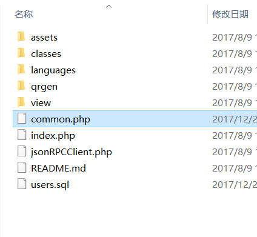
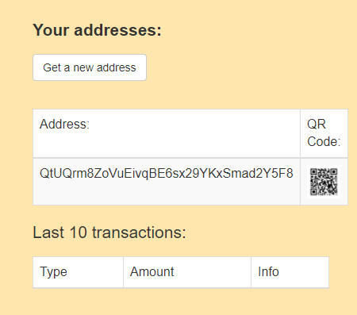
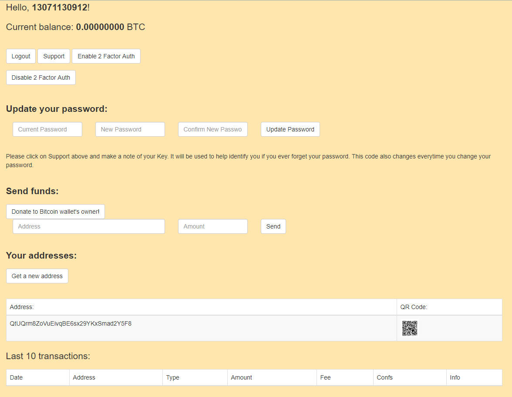
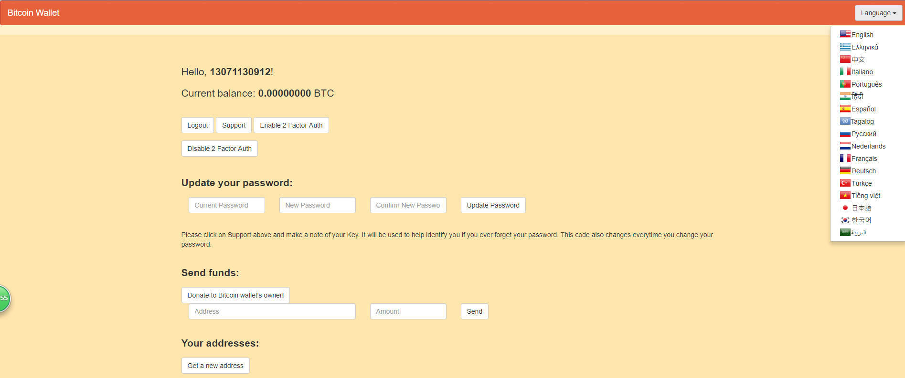
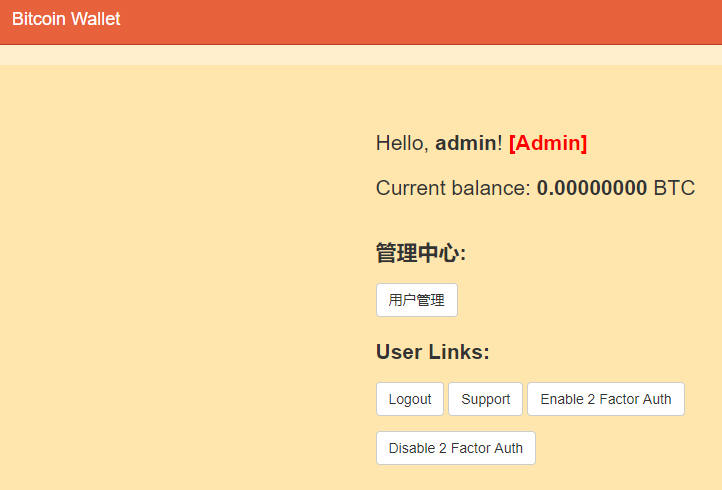

# 区块链web钱包

特点:

- 可以通过用户名注册。

- 支持多国语言。

- 显示最近10笔交易记录。

- API 函数非常清晰，方便对接。

- 二维码地址动态生成

- 支持谷歌安全验证。

- 转币功能。

- ## Screenshots

# 声明

1. 使用本系统方必须在国家相关法律法规范围内并经过国家相关部门的授权许可，禁止用于一切非法行为。

2. 本系统限于测试、实验、研究为目的，禁止用于一切商业运营，本团队不承担使用者在使用过程中的任何违法行为负责。

3. 源码以演示站为准。
